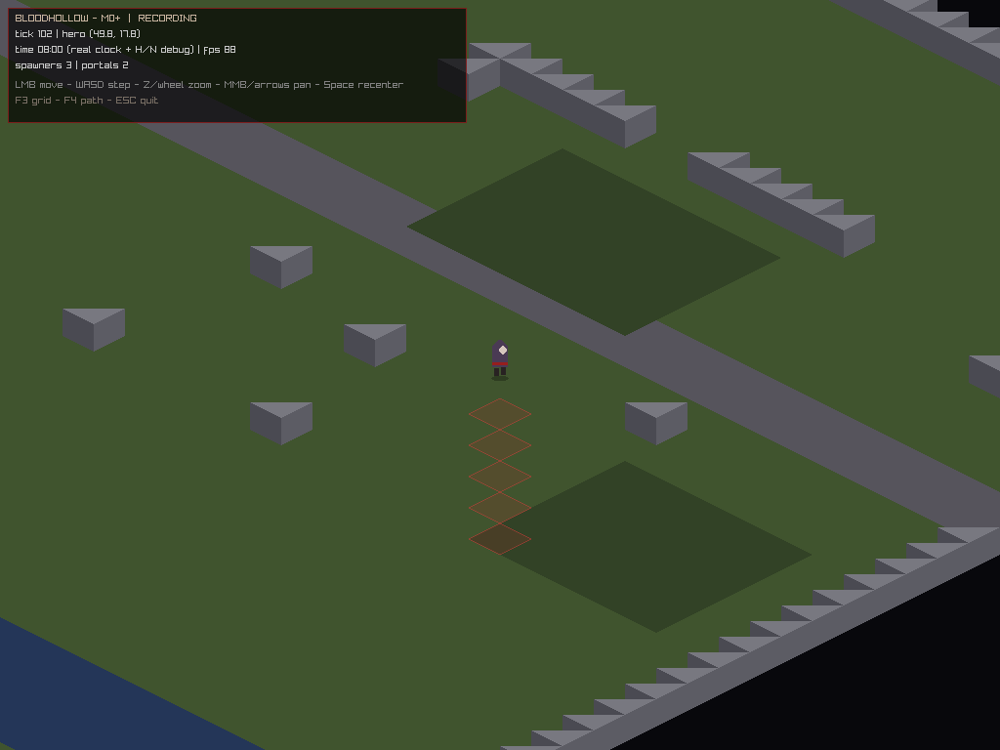
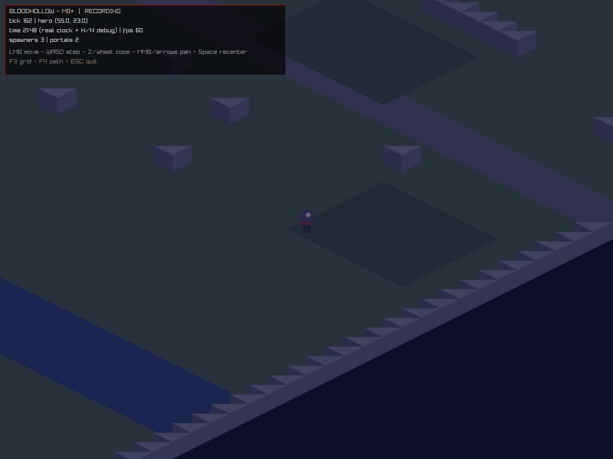

# Devlog 0002 — Sprint 2: determinism becomes a weapon *(2026-09-04)*

Sprint 2 closed the same day it opened (AI-agent throughput; the human calendar
catch-up is the real pacing). Headline: the movement core is now an
integer-only, hashable, replayable sim primitive — the exact code the
authoritative server will run in Phase 1.

## Delivered

- **Walker (`shared/sim/walker.*`)** — the hero's movement rewritten as a
  fixed-point (Q10) one-tile-step state machine. Integer state only, so world
  hashes are bit-stable across runs and machines (ADR-005). 4 ticks/tile era pace
  verified in tests.
- **Replay journal (T-009)** — text journal (events + per-tick FNV-1a state
  hashes), `--record`/`--replay`/`--max-ticks` client modes, and the critical
  design rule: **one command funnel**. Live input, scripted demos and replay
  all call `commandPath`/`commandStep`, so a replay can only diverge if the sim
  itself is nondeterministic.
- **Proof it works**: scripted 220-tick session recorded, replayed →
  **222/222 tick hashes identical**. Tampering one hash line → replay reports
  the exact divergent tick and exits nonzero. This is the debugger for every
  future "players report weird desync" report.
- **Camera (T-007)**: follow-lock, MMB/arrow free-pan with map-bounds clamping,
  zoom anchored at the cursor, stepped Z zoom (1x/2x), Space re-lock.
- **Real day/night (T-008)**: 4-real-hour game day via `sim::hourAt(tick)` —
  12,000 ticks per game hour, HUD shows HH:MM, tint lerps through a dusk/dawn
  warm band. H/N debug offset retained.
- **Map pass 2 (T-010)**: graveyard behind the chapel (blocked gravestones,
  safe zone), market stalls on the plaza edge, mud banks in the marsh, grass
  variation in the east fields. Still 100% generated + CI-diffed.
- **ADRs 001-008 (T-011)** in `docs/adr/` — now binding on agents.

## Verification

- `ctest`: 21 cases, **316,142 assertions, 100% pass** (new: walker arrival
  timing, blocked/corner-cut refusals, double-run bit-identity, journal
  round-trip + garbage rejection, clock wraparound).
- Headless scripted run under Xvfb produced the screenshots above and a
  verifiable journal in the same invocation.
- Replay exit codes: 0 on match, 3 on mismatch (CI-usable).

## Lessons

1. Tick-triggered scripts must be **latched** (`t >= n && !fired`), not
   equality-checked — fixed-pace mode steps multiple ticks per frame and skips
   integer tick values.
2. raylib `TakeScreenshot` writes to the process base path; directory prefixes
   are silently stripped (now documented in main.cpp!).
3. The command-funnel pattern made replay support ~40 lines. Never let input
   touch sim state directly again.

## Next: **Sprint 3-4 — Phase 1 Netcore (the point of online-first)**

T-013 ENet + protocol v0 codegen · T-014 login/persistence · T-015 zone server
(tick loop, entity store, spatial hash) · T-016 authoritative movement + AoI
deltas · T-017 chat + reconnect · **T-018 bots v1 soak gate**. Milestone M1
"Ghost Town Online": a human and 20 bots sharing a world at p99 < 10 ms/tick.
