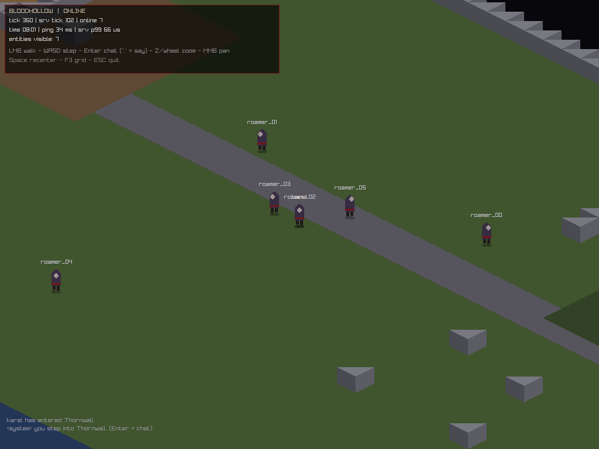

# Devlog 0003 — Sprints 3–4: the town stops being lonely *(2026-09-04)*

Phase 1 "Netcore" landed in one accelerated push. Headline: **M1 "Ghost Town
Online" is passed** — a real human client and 20 bots share one authoritative
world, and the server's worst tick in 600 seconds cost **0.30 ms** (budget:
10 ms).

## Delivered

- **Protocol v0 + codegen (T-013)** — `shared/protocol/messages.md` is the
  single wire source of truth; `tools/protogen/protogen.py` generates
  serializers/docs-in-code from fenced `proto` blocks. Framing
  `[u16 id][u16 len][payload]` LE, `kProtocolVersion = 1`, exact-length
  `PacketView` gate. Attack-surface proven by tests: **every truncated prefix**
  of a fixed-size and a string-bearing message fails to deserialize; malformed
  framing rejected; unknown ids named `unknown`.
- **ENet transport, pinned** — ENet 1.3.18 + SQLite 3.43.2 fetched by hash
  (SHA-256 in `third_party/CMakeLists.txt`), built as plain static libs with
  `SYSTEM` includes so our `-Werror` stays ours (ADR-0009). Reliable-ordered
  channel 0 intentionally (era pacing; sequencing added in Phase 2+ per
  per-packet needs).
- **Zone server (T-015)** — `server/` target: 20 Hz fixed ticks, ENet service
  ≤ 2 ms inside the tick, resync guard, 1 command/session/tick fair share,
  deque entity store + `SpatialGrid<8>` interest management (Chebyshev ≤ 26
  tiles), `[soak]` p50/p99/worldHash telemetry every 30 s, self-grading
  `--soak-secs/--p99-budget-ms` (exit 0/2).
- **Login + persistence (T-014)** — SQLite WAL schema v1 (`accounts`,
  `characters`), auto-register on first login, names 3–16 `[A-Za-z0-9_-]`,
  positions actually written on disconnect ("saved at (x,y)" for every bot).
  **Auth is a documented stub** (ADR-0009): 4096× salted FNV-1a is plumbing for
  the login flow, release-blocked from any non-localhost build until swapped
  for argon2id.
- **Authoritative movement + AoI (T-016)** — clients send intents
  (`InputPath`/`InputStep`), the server paths from live walker state (blocked
  steps refuse cleanly), Q10 `EntityDelta`s broadcast only to interest sets,
  spawn/despawn diffs as AoI membership changes. Client renders a 120 ms lerp
  from the last render position to each authoritative snapshot — same sprite
  atlas for everyone, nameplates over heads, own character tinted white.
- **Chat + reconnect view (T-017)** — channels: say (AoI, "."-prefix), global,
  system. Enter captures focus (all input swallowed while typing), 160-char
  sanitized, 0.5 s rate limit, 12-line on-screen log with composer.
- **Bots v1 (T-018)** — `tools/bots`: N headless wanderers that log in, random-
  walk ±10 tiles, occasionally step and chatter; `[bots] SUMMARY` gates
  welcomed=moved=N/N.
- **Client online mode** — `--server/--port/--name/--pass`; HUD shows state,
  server tick, online count, **ping and server p99 in-client**; offline modes
  untouched (record/replay scripted flows verified byte-identical: 402/402).
  Journal record/replay is now *explicitly offline-only* — the server is
  authoritative, a local journal of an online session would be a lie.

## Verification

- `bh_tests`: **29 cases / 322,899 assertions, 100% pass** (new: bytestream
  bounds + caps, protogen truncation fuzz, spatial-grid brute-force churn incl.
  negative coords, AoI boundary, no-dup re-insert).
- Replay: fresh 400-tick record → **402/402 hashes identical**.
- Online smoke (Xvfb): client welcomed, 7/7 entities visible, screenshot above.
- **M1 gate**: `bh_server --soak-secs 600 --p99-budget-ms 10` + 20 bots →
  `[soak] OK`, exit 0; `[bots] OK`, exit 0. Full logs in
  `docs/devlog/m1-gate-logs/`.

| Gate metric | Value |
| --- | --- |
| Duration | 600 s (12,001 ticks) |
| Bots | 20/20 welcomed, 20/20 moved |
| Tick time | p50 99 µs, **p99 298 µs** (budget 10 ms) |
| Packets relayed | 3,231,785 |
| Desyncs / errors | 0 |

## Lessons

1. GCC 14's `-Wfree-nonheap-object` false-fires on `vector<u8>` reserve+append
   under `-O3` inlining (bhmap saver) — suppressed at exactly one function.
   Warnings-as-errors is still paying for itself; suppression is an event, not
   a habit.
2. ENet 1.x has `peer->data`, not `enet_peer_set_data()` — vendoring by exact
   version means API drift bites exactly once, at compile time, in the first
   build.
3. `deserialize(Reader)` by value beats `Reader&`: with a value-type cursor
   reader, const `PacketView`s work everywhere and no caller can share mutable
   parse state.
4. TakeScreenshot still strips directory prefixes (raylib base path rule from
   devlog 0002) — `--shot` captures land next to the binary with the basename.

## Next: **Sprint 5 — Phase 1 finishes combat-ward**

Phase 1 leftovers before M2 "First Blood": entity kinds beyond players (mob
spawning from the map's spawner table), hit-point deltas that *mean* something,
zone->persistent-position handoff polish, and the first real bot profile that
fights. Board: `docs/tasks/README.md`.
