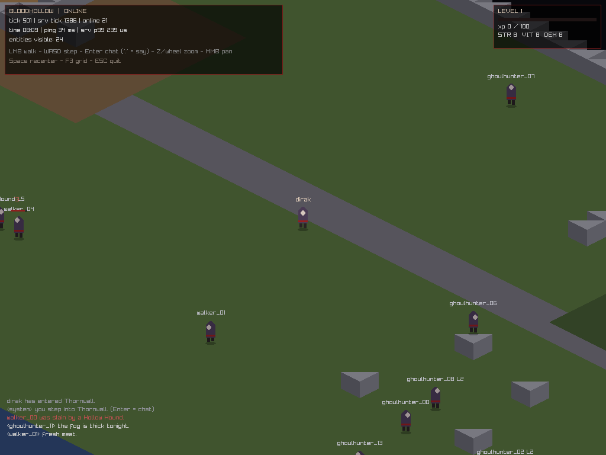

# Devlog 0004 — Sprint 5: first blood on schedule *(2026-09-04)*

Phase 2 opens with the real thing: numbers that hit back. A wanderer now walks
past a Hollow Hound marsh and *dies red-faced* (one did, mid-gate, live).

## Delivered

- **Combat math, GDD-transcribed (T-020, ADR-0010)** — `shared/sim/combat.h`:
  hit `clamp(55 + ACC − EVD, 5, 98)` with ACC=2·DEX / EVD=DEX; damage
  `base·(100+2·STR)/100 · 100/(100+DEF)`, crit 5%×170%; PvP scalar 0.65 wired
  dark. All integer permille, all rolls through the authoritative `sim::Rng`.
- **Stats/XP/levels (T-019)** — literal `kXpNext[26]` table (the `100·L^1.85`
  curve frozen in source, no `powf` in the sim), +3 points/level spent via
  protocol (`StatAssign`), VIT heals by the delta, ding = full heal + global
  system line. Persistence schema v2: `ALTER TABLE` migration (user_version
  guarded) adds str/vit/dex/stat_points; progress saved at logout.
- **First three mobs (T-022)** — `shared/content/mobs.h`: **Marsh Rat**
  (L1, passive), **Feral Ghoul** (L3, aggro 6), **Hollow Hound** (L5, aggro 7).
  Spawner rects from the map populate deterministically on boot, staggered
  brains, leash-to-anchor with den-heal, per-spawner refill on kill.
- **Combat protocol + UX (T-023)** — protocol v2: `AttackRequest`, `CombatEvent`
  (miss/hit/crit/kill pulses to AoI witnesses), `OwnStats` pushes; chat channel
  3 = death feed. Client: click-the-monster to lock and fight, red target ring,
  floating damage, HP bars, level-suffixed nameplates, stat panel with
  F5/F6/F7 point assignment, full-screen YOU DIED beat.
- **Bots: fighter profile (T-024)** — tracks its AoI, chases nearest mob,
  sticky-locks and swings; kills counted off CombatEvents.

## Verification

- `bh_tests`: **35 cases / 327,074 assertions** (new: hit-clamp distributions,
  twin-Rng determinism, damage formula spots incl. chip ≥1, XP-curve
  monotonicity + cap semantics, world-level: kill-a-rat → XP, hound aggro &
  leash release, player death → 60-tick town respawn, spawner refill).
- **S5 gate**: 620 s soak, 14 fighters + 6 wanderers: server
  **p99 = 0.17 ms vs 10 ms budget** (12,391 ticks), fighters 14/14 welcomed,
  **39 kills**, wanderers 6/6 OK, exit 0 everywhere. Logs archived in
  `docs/devlog/s5-gate-logs/`. (One fighter disconnected mid-run with position
  saved — rejoin-capable; noted for the reconnect pass in S7.)

## Lessons

1. ALTER-migrations must run *after* CREATE on fresh DBs — order your open().
2. `xpNext(cap) == 0` is a *semantic* (no next bar); tests should encode
   contracts, not table accidents.
3. Content density is load-bearing: 14 fighters drained all 3 spawners to zero
   for minutes at a time. S7 gets a density rule (throughput ≥ concurrent
   hunters) — credited to the soak, not vibes.

## Next: Sprint 6 — inventory/equip/loot, death×XP-debt, vendors, skills v1

Myth of Soma joined the research shelf and hijacked the look target (with
Helbreath's sprite/VFX/UI wins and a head-to-head visual note from the
director). Weapon mastery + Anvil auras inked into the roadmap; moral-economy
carrot/stick queued for P3; "nights never pitch-black" now a hard art rule.
