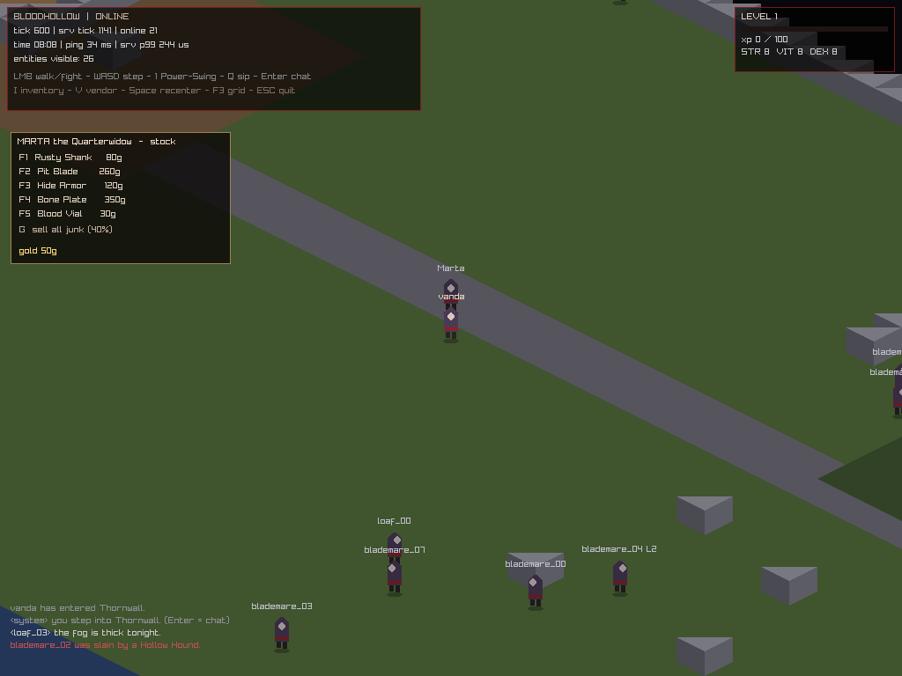

# Devlog 0005 — Sprint 6: loot, debt, and a widow at the gate *(2026-09-04)*

Sixth sprint, still Phase 2. New deadliness: things you kill drop things you
want, things that kill you take something back.

## Delivered

- **Inventory / equip / loot (T-021)** — `content/items.h`: two weapons, two
  armors, Blood Vial, three junk drops. Slots cap 32, stacks by rule, one item
  per equip slot; equips feed the GDD formulas for real (weapon dmg replaces
  fists, armor feeds DEF). Kills roll the mob's loot chance + gold range,
  auto-loot with a whisper line. Protocol v3 adds the InventoryReset+ItemSlot
  stream; client panel on **I**, click-to-use/equip, **Q** quick-sips a vial.
- **Death costs (T-025)** — GDD-debt: 10% of the bar at L1 → 25% at L25, falling
  *backwards through prior bars* so 0-XP death **de-levels you** (hp+hpMax
  recomputed). Whispered: «death debt: -160 XP» / «the debt breaks you:
  de-level to 4». Respawn stays 3 s at town.
- **Skills v1 (T-026)** — **Power Swing**: 140% weapon, 40-tick cooldown,
  red-caps «Power-Swing!» floater over the caster — the Helbreath callout
  language, adopted along with the video reference this sprint. Plus the Soma
  adoption's first install: **weapon skill raises by use** (+1 / 25 landed
  hits, cap 100; +1 attack per 20 skill), whispered at the mastery notches.
- **Vendor (T-027)** — Marta the Quarterwidow stands at town spawn: five-stock
  shop, junk pawn at 40%, proximity-validated buys, atomic gold checks. Schema
  v3 persists gold + inventory blob across logins.
- **Bots 1.5 (T-028)** — fighters buy a vial at login, sip under 50% HP, weave
  Power Swings; SUMMARY prints pots/swings/maxLevel. And yes: the first live
  smoke caught my fighter flock besieging Marta (wire-kind collision; filtered
  ≥64, added a note to the bot's memo pad).

## Verification

- `bh_tests`: **39 cases / 327,108 assertions, 100% pass** (new: buy/equip/armor
  invariants, 40% pawn math, sip cooldown + full-hp refusal, XP-debt exact values
  incl. de-level through bars, Power-Swing event + CD gating).
- Live smoke: 10 fighters, 42 s — 9 kills, power swings (35), maxLevel 2
  reached, soak p99 0.13 ms.
- Gate-soak of record (**660 s**, 14 fighters + 6 wanderers, archived at
  `logs/2026-09-04-s6-gate-srv.log`): `FINISH ticks=13201 entities=21
  p99=167us` -> **OK p99=0.17 ms vs 10 ms budget**. Fighters: welcomed 14/14,
  moved 14/14, minDeltas 12800, kills 23, pots 114, swings 168, maxLevel 3.
  Wanderers 6/6. Server self-disconnected clients cleanly, zero crashes.

## Lessons

1. **Never reference deque elements across `despawn`** — tail-shifting aliases
   your handle into the next entity; tests must re-`find(id)` per tick. The
   "rat that wouldn't die at hp 1" was a player-shaped ghost of memory. This is
   now documented in the test header comment.
2. String-edit discipline: three silent no-op replaces cost a rebuild loop;
   patch scripts now `assert` every target.
3. ENet protocol versioning is doing its job: v1/v2 client+server pairs would
   have greeted each other with reason=4 instead of half-parsing.

## Next: Sprint 7 — trade window, fields content to L12 (density rule enforced),
bots v2 balancer (TTK + XP/hr table), then **the M2 gate: Blood on the Fields**.