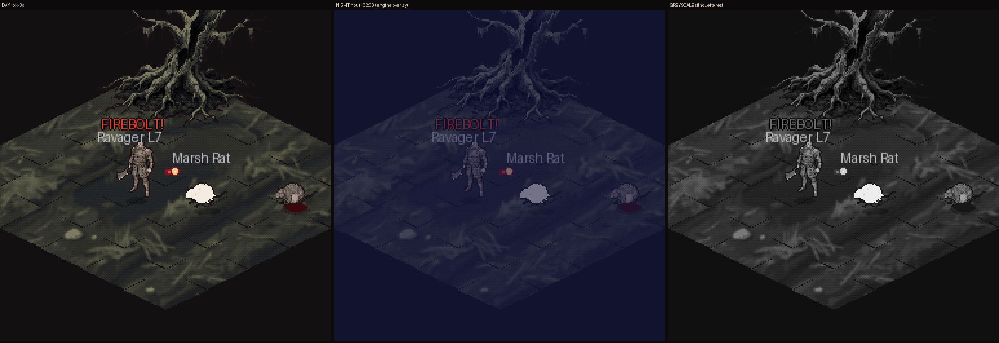

# Style-lock proof — B0 gate (bible §0 step 2, §4)

**Status: APPROVED 2026-09-08** — see `docs/art/B0-GATE-DECISION.md` (gate sign-off + D1–D12
rulings). Volume work (B1+) may start. Carried fix: plate min-luma 22.1 < 24 →
clamp the floor to 24 in `make_ground_tiles` at B1 (no new plate needed).



`style_tile_board_3x.png` = the 256×256 scene at 3× nearest, three ways:
**day** · **engine night** (`nightOverlay(2.0)` = `(18,22,70,145)`, the real
`render/daynight.cpp` keyframes, alpha 57 %) · **greyscale** (silhouette test).
Native files: `style_tile_256_day.png`, `_night.png`, `_grey.png`.

## What the scene proves

| Bible lock | Element in tile | How it was made |
|---|---|---|
| Terrain = Soma painterly | Fields of the Overflow mud/furrow ground; 2-tile dead willow with root cluster | 4× painterly plate → box-reduce + blur → contrast 0.70 + floor lift → 32-colour quantize, Bayer-2 dither → diamonds **cut from one plate** at screen position (`cut_diamond`) |
| Characters = Helbreath | Ravager (43 px body — requested 46, clipped by the cell top; see `docs/art/60-paperdoll-layers.md` — oversized cleaver, chain belt, sallow skin) · Marsh Rat ×2 (20 px, low teardrop) | 4× plate → chroma key → nearest downscale → gamma-lift palette → 32-colour quantize, Bayer-2 → 1 px `#1a1214` outline → 32×48 cell, feet y=42, alpha-70 contact ellipse (placeholder.cpp geometry) |
| Combat storytelling = HB | "FIREBOLT!" red-caps callout (T-066 kind-5 colour `255,60,40`), name tags in the neutral band tint `190,190,200`, T-066 white hit-flash frame on the struck rat | hand-drawn in `make_style_tile.py` |
| Grade = L1 + DE accents | whole scene ≤ 30 % saturation; only saturated pixels = callout + Firebolt ember/arterial + blood decal | palette audit below |
| Gore language | matte `#3A080C` decal under the far rat | §4.4 |
| Night rule | night panel legible; both sprites + tree pass silhouette | engine overlay, not synthetic |

## Audit (`style_tile_audit.json`, regenerated by the script)

| Check | Value | Gate | Result |
|---|---|---|---|
| Palette sizes | mob 32 · player 32 · terrain 32 | ≤ 32 per family | pass |
| Opaque colours per cell | rat 26 · ravager 31 · tree 28 · tiles 22 | ≤ 32 | pass |
| R-LUMA Δ (sprite − terrain) | ravager **+23.7** · rat **+26.8** | ≥ 25 | rat pass · ravager **marginal** (see note 1) |
| Night alpha at 02:00 | 145/255 = 57 % | ≤ ~65 % | pass |
| Cells | 32×48 both; tree 138×112 | §5 | pass |
| Dither visible | yes (Bayer-2 on flesh, bark, mud) | era feature | pass |
| Plate min luma | **22.1** (`bh_qa_sheet --kind plate`) | ≥ 24 (above outline `#1a1214`) | **fail by 2** — the darkest mud pixels sit below the sprite outline; fix at B1 by clamping the plate floor to 24 in `make_ground_tiles` (does not need a new plate) |
| R-LUMA, rulebook definition (body excl. outline) | ravager **+42.7** · rat **+50.0** (`qa/cell_*_audit.json`) | ≥ 25 | pass — the 23.7 above included the outline ring |
| Accent hue on terrain/gear | none | reject if present | pass |

## Notes for the director (answered 2026-09-08 — rulings in `docs/art/B0-GATE-DECISION.md`: D1 corrected definition + selective rim · D2 32×48 · D3 floor +0 · D4 7×11)

1. **Ravager Δ = 23.7 vs gate 25.** Two honest options: (a) accept 23 as the
   *player* gate (players carry name tags + HP bar, mobs don't), or (b) add the
   1 px bone rim on the lit shoulder edge (R-LUMA fix step 3). I recommend (b)
   for the B6 base bodies and leave the tile as-is so you can see the un-rimmed
   read.
2. **Zoom.** 43 px body (measured) on a 32 px tile-height = 1.34 tile-heights (HB ≈ 1.7,
   Soma ≈ 2.4). If this reads "too small", the only non-sim-breaking lever is
   a 32×56 player cell (body 52 px) — `loadAtlas` takes any frameH; the feet
   anchor stays 42→50. Say the word and B6 uses 32×56.
3. **Terrain grade.** The mud is deliberately at luma ≈ 51 (L1 Tower floor is
   ≈ 95). It is dark because Vessalia is; the L1 grade is achieved by keeping
   sprites at ≈ 75+ and nothing pitch-black. If you want the L1 floor brighter,
   change `lift floor` in `make_ground_tiles` (currently `*0.95 + 14`).
4. **Callout font.** The tile uses Pillow's default bitmap font as a stand-in.
   Two hand-authored drafts now exist for the decision (D4): 5×7 (parity with
   the client's raylib default @ size 10 ⟨UNVERIFIED cap height⟩) and 7×11
   (rulebook R-TEXT) — `export/font/font_specimen_3x.png`; regenerate with
   `python3 tools/atlaspack/bhfont.py`. Neither is wired into the client
   (`game.cpp:904` still `DrawText`; proposed T-ART-13).

## Reproduce

```
python3 tools/atlaspack/make_style_tile.py    # deterministic, ~1 s
```
Plates (`plates/*_4x_raw.png`) were generated 2026-09-07 with the prompts in
`plates/PROMPTS.md`; provenance entry in `assets/LICENSES.md` (research-only
copies live here; nothing is shipped from `docs/`).
